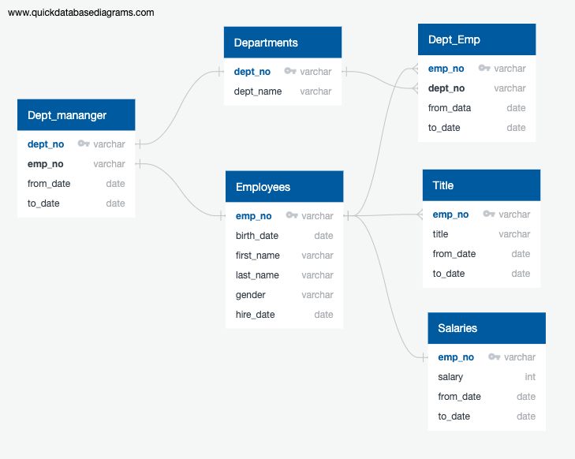

# Pewlett-Hackard-Analysis.

Pewlett-Hackard has it's employee data into .csv files. They would like to migrate the data to a database and analyze different aspects of their retiring employees.

## Install Prerequisites

[Install PostgresSQL](https://www.enterprisedb.com/downloads/postgres-postgresql-downloads)

## Challenge

Architecture the database helps us understand the structure of the tables we built and the flow of data from table to table. For this project, we used [QuickDBD](https://app.quickdatabasediagrams.com) to wireframe out schemas.

The schemas help us understand the tables structure and data relationships necessary for the challenge task:

  - Create a new table retirement_info_with_title containing the retiring employee number, first and last name, title, hire date, salary. The resulting table is 65424 rows long but we can observe that some employees appear multiple times in that list.

  - To solve the duplicate employee entries, we run a query to remove duplicate titles, keeping only the most recent. A new table retirement_info_without_duplicate_title is created based on that query that that has significantly less data (41380 rows)

  - A more in-depth analysis of the employees per title is saved into count_by_title table. We observe that senior engineer, senior staff engineer and engineering are titles with the most counts making the engineering department the most vulnerable.
  
  -  The last part of the project was creating a list of potential mentors from the people that have been with the company for a long time and have a extensive experience. The list of mentors is saved in mentors_data and includes 1549 results. Even if the engineering department will have the most employees retiring, it also has the most potential mentors (788). With the provided data Pewlett-Hackard can create a strategy to use the experience of the existing employees to train for around 3500 new hires over a 3 year period in that department.
